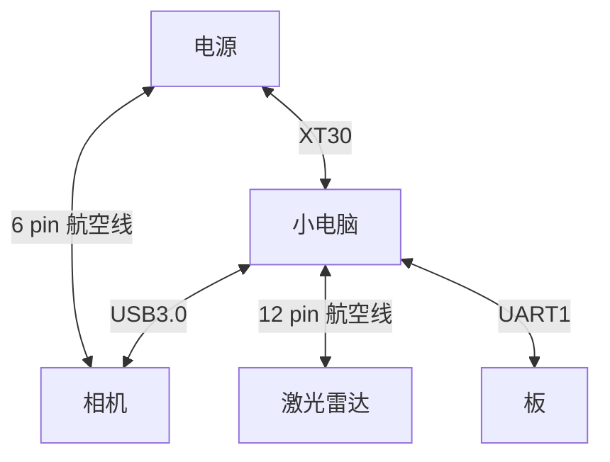

# 作业1

> 1. 请回答本教程中所有穿插的提问，简单阐述理由即可。
> 2. 请简单画出步兵视觉的接线图
> 3. 请完成在[github上⾯的作业题⽬](https://github.com/ybwowen/2025-vision-training)

## 1. 请回答本教程中所有穿插的提问，简单阐述理由即可。

### 分辨率、靶面尺寸、像元大小

分辨率是指在单位面积内的像素数量，靶面尺寸是指传感器的物理尺寸，像元大小是指每个像素的物理尺寸。

$(1440^2 + 1080^2)\times3.45$&mu;m $\approx\frac{1}{2.9}\times16$mm

## 2. 请简单画出步兵视觉的接线图

